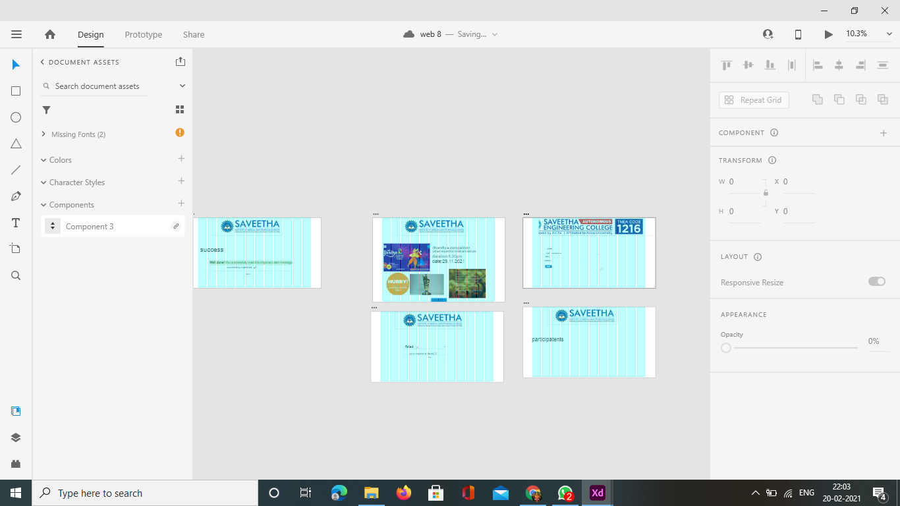
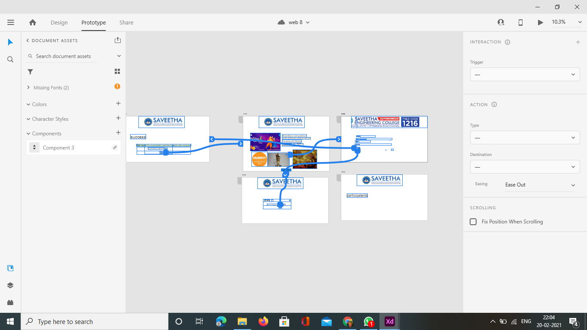
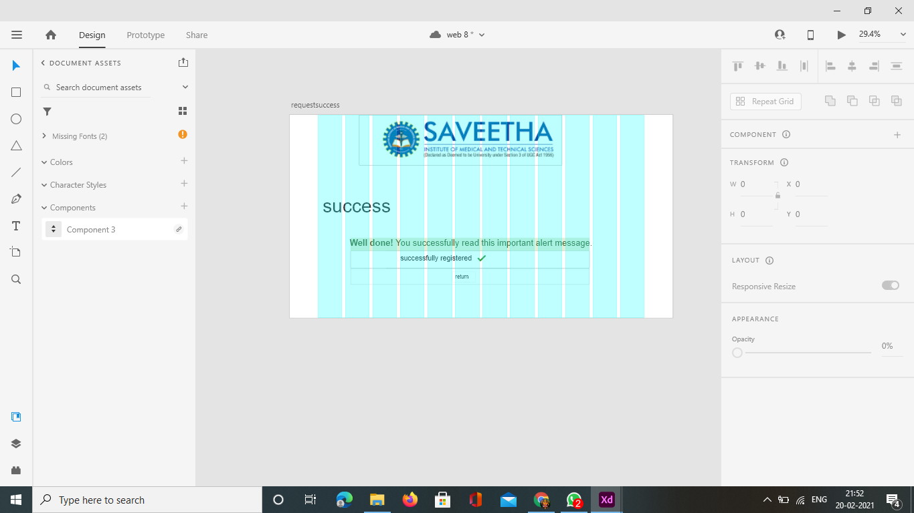

# WebApplication for Event Registration

## AIM:
To create a design and develop a web application for event registration.
## DESIGN STEPS:


## DESIGN SCREENS:


## WIREFRAME:


## PROTOTYPE: 


## PROGRAM:

### home.html
```
<!doctype html>
<html lang="en">
  <head>
    <!-- Required meta tags -->
    <meta charset="utf-8">
    <meta name="viewport" content="width=device-width, initial-scale=1, shrink-to-fit=no">

    <!-- Bootstrap CSS -->
    <link rel="stylesheet" href="https://maxcdn.bootstrapcdn.com/bootstrap/4.0.0/css/bootstrap.min.css" integrity="sha384-Gn5384xqQ1aoWXA+058RXPxPg6fy4IWvTNh0E263XmFcJlSAwiGgFAW/dAiS6JXm" crossorigin="anonymous">

    <title>dance programme</title>
  </head>
  <body>
     
      <div class="jumbotron jumbotron-fluid" style="background-color:aquamarine;">
        <div class="container  text-center">
            
            
            <h1>saveetha institute medical science</h1>
        </div>
      </div>

        <div class="container text-center" style="text-align:aquamarine;">
            <div class="row">
            <div class="card col-12 col-md-6 col-lg-6">
            
            </div>
            
            <div class="col-6">
            <h1 class="text-right" >DHANDIYA COMPITION</h1>
            <h1 class="text-right">venue:saveetha engineering college</h1>
            <h1 class="text-right">duration:6.00pm</h1>
            <h1 class="text-right" >date:29.11.2021</h1>
            </div>
            </div>
        </div>
       
        <div class="container text-right">
            <div class="row">
            <div class="card col-12 col-md-6 col-lg-4">
            
            </div>
             <div class="card col-12 col-md-6 col-lg-4">
            
            </div>
            <div class="card col-12 col-md-6 col-lg-4">
            
            </div>
            </div>
        </div>
        <div class="container">
        <div class="row">
        <div class="col-12 text-center">
            <a href="/register/" class="btn btn-primary btn-lg" role="button" >Register</a>
        </div>
    </div>
</div>
        
    <!-- Optional JavaScript -->
    <!-- jQuery first, then Popper.js, then Bootstrap JS -->
    <script src="https://code.jquery.com/jquery-3.2.1.slim.min.js" integrity="sha384-KJ3o2DKtIkvYIK3UENzmM7KCkRr/rE9/Qpg6aAZGJwFDMVNA/GpGFF93hXpG5KkN" crossorigin="anonymous"></script>
    <script src="https://cdnjs.cloudflare.com/ajax/libs/popper.js/1.12.9/umd/popper.min.js" integrity="sha384-ApNbgh9B+Y1QKtv3Rn7W3mgPxhU9K/ScQsAP7hUibX39j7fakFPskvXusvfa0b4Q" crossorigin="anonymous"></script>
    <script src="https://maxcdn.bootstrapcdn.com/bootstrap/4.0.0/js/bootstrap.min.js" integrity="sha384-JZR6Spejh4U02d8jOt6vLEHfe/JQGiRRSQQxSfFWpi1MquVdAyjUar5+76PVCmYl" crossorigin="anonymous"></script>
  </body>
</html>
```
### register.html
```
<!doctype html> 
<html lang="en">

<head>
    <!-- Required meta tags --> 
    <meta charset="utf-8">
    <meta name="viewport" content="width=device-width, initial-scale=1, shrink-to-fit=no">

    <!-- Bootstrap CSS -->
    <link rel="stylesheet" href="https://maxcdn.bootstrapcdn.com/bootstrap/4.0.0/css/bootstrap.min.css"
        integrity="sha384-Gn5384xqQ1aoWXA+058RXPxPg6fy4IWvTNh0E263XmFcJlSAwiGgFAW/dAiS6JXm" crossorigin="anonymous">

     <title>dance programme</title>
  </head>
  <body>
       <div class="jumbotron" style="box-sizing: border-box;">
      <div class="p-5 text-center bg-image" style="
      background-image: url('https://encrypted-tbn0.gstatic.com/images?q=tbn:ANd9GcTK-3iM5cARVJ1SFV_PSQT_nBgShVZIBMtyCw&usqp=CAU');
      height: 200%;background-repeat: no-repeat;background-size: cover;">
        <div class="container">
      
      <div class="jumbotron jumbotron-fluid" style="background-color:aquamarine;">
        <div class="container  text-center">
            
            
            <h1>saveetha institute medical science</h1>
        </div>
      </div>

    <div class="container">
        <div class="row">
            <div class="col-12">
                <h1>Application</h1>
            </div>
        </div> 
       <form action="/register/" method="POST">
        
        <div class="container display-4 text-center" style=color:white >
        <div class="form-group">
            <label for="username">NAME</label>
            <input type="text" class="form-control" id="username" name="username" placeholder="Enter your name">
        </div>
        <div class="form-group">
            <label for="phone">MOBILE</label>
            <input type="text" class="form-control" id="phone" name="phone" placeholder="Enter your Phone.no">
        </div>
        <div class="form-group">
            <label for="email">EMAIL</label>
            <input type="email" class="form-control" id="email" name="email" placeholder="name@example.com">
        </div>
        <div class="form-group">
            <label for="institution">institution</label>
            <input type="text" class="form-control" id="institution" name="institution" placeholder="Institution name">
        </div>
        <div class="col-12 text-center">
              
              <input type="submit" class="btn btn-primary btn-lg"  aria-pressed="true">sumbit</a>
              
        </div>
    </div>
    </form>

    </div>
    </div>

    <!-- Optional JavaScript -->
    <!-- jQuery first, then Popper.js, then Bootstrap JS -->
    <script src="https://code.jquery.com/jquery-3.2.1.slim.min.js"
        integrity="sha384-KJ3o2DKtIkvYIK3UENzmM7KCkRr/rE9/Qpg6aAZGJwFDMVNA/GpGFF93hXpG5KkN"
        crossorigin="anonymous"></script>
    <script src="https://cdnjs.cloudflare.com/ajax/libs/popper.js/1.12.9/umd/popper.min.js"
        integrity="sha384-ApNbgh9B+Y1QKtv3Rn7W3mgPxhU9K/ScQsAP7hUibX39j7fakFPskvXusvfa0b4Q"
        crossorigin="anonymous"></script>
    <script src="https://maxcdn.bootstrapcdn.com/bootstrap/4.0.0/js/bootstrap.min.js"
        integrity="sha384-JZR6Spejh4U02d8jOt6vLEHfe/JQGiRRSQQxSfFWpi1MquVdAyjUar5+76PVCmYl"
        crossorigin="anonymous"></script>
</body>

</html>

```
### result.html
```
<!doctype html> 
<html lang="en">

<head>
    <!-- Required meta tags --> 
    <meta charset="utf-8">
    <meta name="viewport" content="width=device-width, initial-scale=1, shrink-to-fit=no">

    <!-- Bootstrap CSS -->
    <link rel="stylesheet" href="https://maxcdn.bootstrapcdn.com/bootstrap/4.0.0/css/bootstrap.min.css"
        integrity="sha384-Gn5384xqQ1aoWXA+058RXPxPg6fy4IWvTNh0E263XmFcJlSAwiGgFAW/dAiS6JXm" crossorigin="anonymous">

     <title>dance programme</title>
  </head>
  <body>
       <div class="jumbotron" style="box-sizing: border-box;">
      <div class="p-5 text-center bg-image" style="
      background-image: url('https://encrypted-tbn0.gstatic.com/images?q=tbn:ANd9GcTK-3iM5cARVJ1SFV_PSQT_nBgShVZIBMtyCw&usqp=CAU');
      height: 200%;background-repeat: no-repeat;background-size: cover;">
        <div class="container">
      
      <div class="jumbotron jumbotron-fluid" style="background-color:aquamarine;">
        <div class="container  text-center">
            
            
            <h1>saveetha institute medical science</h1>
        </div>
      </div>

    <div class="container">
        <div class="row">
            <div class="col-12">
                <h1>Application</h1>
            </div>
        </div> 
       <form action="/register/" method="POST">
        
        <div class="container display-4 text-center" style=color:white >
        <div class="form-group">
            <label for="username">NAME</label>
            <input type="text" class="form-control" id="username" name="username" placeholder="Enter your name">
        </div>
        <div class="form-group">
            <label for="phone">MOBILE</label>
            <input type="text" class="form-control" id="phone" name="phone" placeholder="Enter your Phone.no">
        </div>
        <div class="form-group">
            <label for="email">EMAIL</label>
            <input type="email" class="form-control" id="email" name="email" placeholder="name@example.com">
        </div>
        <div class="form-group">
            <label for="institution">institution</label>
            <input type="text" class="form-control" id="institution" name="institution" placeholder="Institution name">
        </div>
        <div class="col-12 text-center">
              
              <input type="submit" class="btn btn-primary btn-lg"  aria-pressed="true">sumbit</a>
              
        </div>
    </div>
    </form>

    </div>
    </div>

    <!-- Optional JavaScript -->
    <!-- jQuery first, then Popper.js, then Bootstrap JS -->
    <script src="https://code.jquery.com/jquery-3.2.1.slim.min.js"
        integrity="sha384-KJ3o2DKtIkvYIK3UENzmM7KCkRr/rE9/Qpg6aAZGJwFDMVNA/GpGFF93hXpG5KkN"
        crossorigin="anonymous"></script>
    <script src="https://cdnjs.cloudflare.com/ajax/libs/popper.js/1.12.9/umd/popper.min.js"
        integrity="sha384-ApNbgh9B+Y1QKtv3Rn7W3mgPxhU9K/ScQsAP7hUibX39j7fakFPskvXusvfa0b4Q"
        crossorigin="anonymous"></script>
    <script src="https://maxcdn.bootstrapcdn.com/bootstrap/4.0.0/js/bootstrap.min.js"
        integrity="sha384-JZR6Spejh4U02d8jOt6vLEHfe/JQGiRRSQQxSfFWpi1MquVdAyjUar5+76PVCmYl"
        crossorigin="anonymous"></script>
</body>

</html>
```
### views.py
```
from django.shortcuts import render
from .models import participatent

# Create your views here.
def home(request):
    context = {}
    return render(request,'eventapp/home.html',context)
def register(request):
    context = {}
    if request.method == 'POST':
        p1 = participatent()
        p1.username = request.POST.get('username','-')
        p1.email = request.POST.get('email','-')
        p1.email = request.POST.get('phone','-')
        p1.email = request.POST.get('insitution','-')

        if  len(participatent.objects.all())>10:
            return render(request,'eventapp/failed.html',context)
        else:
            p1.save()
            return render(request,'eventapp/success.html',context)
    if request.method == 'GET':
        context['username'] = ''
        context['email'] = ''
        context['phone'] = ''
        context['insitution'] = ''


    return render(request, 'eventapp/register.html', context)
def result(request):
    context = {}

    context['participant'] = participatent.objects.all()

    return render(request, 'eventapp/result.html', context)
```
## OUTPUT:



## RESULT:
Thus, a UX design and develop a web application for event registration has been done.